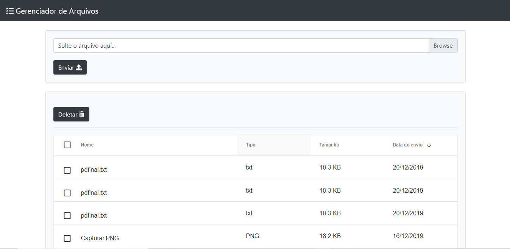

# Front Desafio Inmetrics

<div style="text-align:center"></div>

## Descrição
Um aplicativo da web de gerenciador de arquivos com Spring, mongo e vuejs no front-end com integração de tabelas de dados do gr-grid

## Requisitos de sistema
* Node.js

## Setup Projeto
```
1 - Iniciar a API com Java e Spring -> https://github.com/rolandonanet/API_Desafio_Kernel
```

```
2 - npm install
```

### Comando para iniciar a aplicação
```
npm run serve
```
